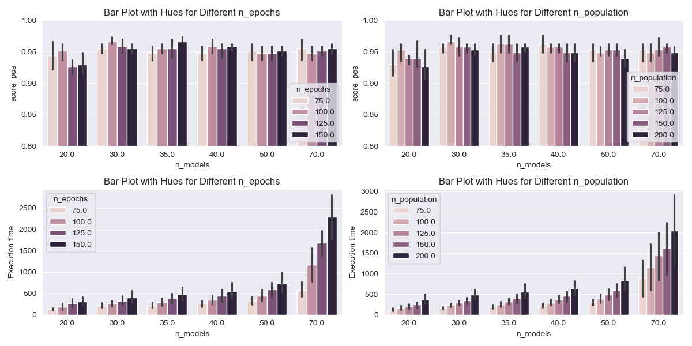

# Genetic Forest Classifier

## Overview

This repository contains an implementation of a genetic algorithm for evolving decision trees for classification tasks. The decision tree structure is defined by the `Node` class, and the entire genetic algorithm is orchestrated by the `Genetic` class. 

## Classes

### 1. `Node`

The `Node` class represents a node in the decision tree. Each node has attributes such as `name`, `value`, `cond_type`, `depth`, and `leaf`. The `decision` method is used to make decisions based on the node's conditions.

### 2. `Tree`

The `Tree` class is responsible for creating the initial decision tree and defining its structure. It uses the `Node` class to represent nodes. The decision tree is then evolved using a genetic algorithm, and the best tree is determined based on classification accuracy.

### 3. `GenForest`

The `GenForest` class implements a Genetic Forest, an ensemble of decision trees using genetic algorithms. It utilizes the `Tree`, `Node`, and `Genetic` classes to train the ensemble and make predictions.

## Usage

To use this implementation, follow these steps:

```python
# Import necessary libraries and classes
import numpy as np
from gen_forest import GenForest

# Example data
all_features = ["feature1", "feature2", "feature3"]
targets = np.array([0, 1, 0, 1, 1])

# Create a GenForest instance
genetic_forest = GenForest(features=all_features, targets=targets, n_species=5, n_features=3, n_agents=10, epochs=50, n_deaths=5, rounds_deaths=3, seed=123)

# Fit the GenForest model on training data
x_train = np.random.rand(100, 3)
y_train = np.random.randint(2, size=100)
genetic_forest.fit(x_train, y_train)

# Make predictions using the GenForest model
x_test = np.random.rand(10, 3)
predictions = genetic_forest.predict(x_test, bests=True)

# Evaluate accuracy
accuracy_value = genetic_forest.accuracy(predictions, y_test)
print("Accuracy:", accuracy_value)
```

# Benchmark

## Context
When initially conceptualizing the experiment, we considered utilizing a Random Forest algorithm combined with the Genetic Algorithm (GA) approach. Following the initial analysis, we chose to implement a second GA to augment the results obtained from the initial algorithm.

To achieve this goal, we designed a GA responsible for ensemble learning and also selecting the most promising models trained by the first GA. This GA performs predictions using Soft Voting, which involves weighting each model to enhance the overall score.

## Initial Parameters Analysis:

Number of models: [20, 30, 35, 40, 50, 70]
Number of epochs: [75, 100, 125, 150]
Size of Population: [75, 100, 125, 150, 200]
Only a few models achieved a similar score to the Random Forest (baseline algorithm).

### Performance Analysis
|  | n\_models | n\_epochs | n\_population | score\_pos | time |
| :--- | :--- | :--- | :--- | :--- | :--- |
| 3 | 20.000 | 75.000 | 150.000 | 0.981 | 140.051 |
| 27 | 30.000 | 100.000 | 125.000 | 0.981 | 273.879 |
| 31 | 30.000 | 125.000 | 100.000 | 0.981 | 237.955 |
| 52 | 35.000 | 125.000 | 125.000 | 0.981 | 361.880 |
| 56 | 35.000 | 150.000 | 100.000 | 0.981 | 347.313 |
| 65 | 40.000 | 100.000 | 75.000 | 0.981 | 196.178 |
| 102 | 70.000 | 75.000 | 125.000 | 0.981 | 551.002 |

Considering both execution time and improvements in the score metric, we have chosen the following parameter intervals for the study:

Number of models: [30, 35]
Number of epochs: [100, 200]
Size of Population: [125, 200]



## Results

First, a study was conducted to assess the effects of the Mutation Rate, the introduction of Predation and Genocide, and the crossover method (Elitism - the best vs all and Tournament random parents).

Following this, we examined the results on two datasets while maintaining a constant Mutation rate (0.04):

Wine dataset: A simpler dataset consisting of (178x13) dimensions.
Health dataset: A more complex dataset with (2113x21) dimensions.


### Methods Analysis
|  | Taxa Mutação | Predação | Genocídio | Método\_x | best\_score\_x | Método\_y | best\_score\_y |
| :--- | :--- | :--- | :--- | :--- | :--- | :--- | :--- |
| 0 | 0.01 | Predacao | Genocidio | Elitismo | 0.972222 | Torneio | 0.916667 |
| 1 | 0.04 | Predacao | Genocidio | Elitismo | 0.972222 | Torneio | 0.888889 |
| 2 | 0.07 | Predacao | Genocidio | Elitismo | 0.833333 | Torneio | 0.888889 |
| 3 | 0.01 | Predacao | Sem Genocídio | Elitismo | 0.944444 | Torneio | 0.944444 |
| 4 | 0.04 | Predacao | Sem Genocídio | Elitismo | 0.944444 | Torneio | 0.944444 |
| 5 | 0.07 | Predacao | Sem Genocídio | Elitismo | 0.916667 | Torneio | 0.888889 |
| 6 | 0.01 | Sem Predação | Genocidio | Elitismo | 0.861111 | Torneio | 0.972222 |
| 7 | 0.04 | Sem Predação | Genocidio | Elitismo | 0.861111 | Torneio | 0.944444 |
| 8 | 0.07 | Sem Predação | Genocidio | Elitismo | 0.861111 | Torneio | 0.916667 |
| 9 | 0.01 | Sem Predação | Sem Genocídio | Elitismo | 1.000000 | Torneio | 0.916667 |
| 10 | 0.04 | Sem Predação | Sem Genocídio | Elitismo | 0.944444 | Torneio | 0.944444 |
| 11 | 0.07 | Sem Predação | Sem Genocídio | Elitismo | 0.944444 | Torneio | 0.944444 |

### Performance Analysis
|  | Taxa Mutação | Método | Predação | Genocídio | Pre\_Wine | Pos\_Wine | Pre\_Health | Pos\_Health |
| :--- | :--- | :--- | :--- | :--- | :--- | :--- | :--- | :--- |
| 0 | 0.04 | Elitismo | Predacao | Genocidio | 0.944444 | 0.861111 | 0.799054 | 0.836879 |
| 1 | 0.04 | Elitismo | Predacao | Sem Genocídio | 0.750000 | 0.888889 | 0.780142 | 0.834515 |
| 2 | 0.04 | Elitismo | Sem Predação | Genocidio | 0.861111 | 0.861111 | 0.780142 | 0.827423 |
| 3 | 0.04 | Elitismo | Sem Predação | Sem Genocídio | 0.888889 | 0.833333 | 0.784870 | 0.827423 |
| 4 | 0.04 | Torneio | Predacao | Genocidio | 0.888889 | 0.888889 | 0.799054 | 0.827423 |
| 5 | 0.04 | Torneio | Predacao | Sem Genocídio | 0.888889 | 0.861111 | 0.780142 | 0.813239 |
| 6 | 0.04 | Torneio | Sem Predação | Genocidio | 0.944444 | 0.944444 | 0.780142 | 0.822695 |
| 7 | 0.04 | Torneio | Sem Predação | Sem Genocídio | 0.888889 | 0.861111 | 0.789598 | 0.836879 |

It's evident that when the first GA performs relatively well, the second GA doesn't yield substantial improvements. However, in cases where the results of the first GA fall below expectations (e.g., less than 80%), the second GA can effectively identify more promising models and enhance the overall performance by approximately 5%.

### Contributors
- Rafael Souza
- Arthur Hiratsuka Rezende
- João Augusto Fernandes
- Thiago Ambiel
- João Pedro Farjoun Silva
